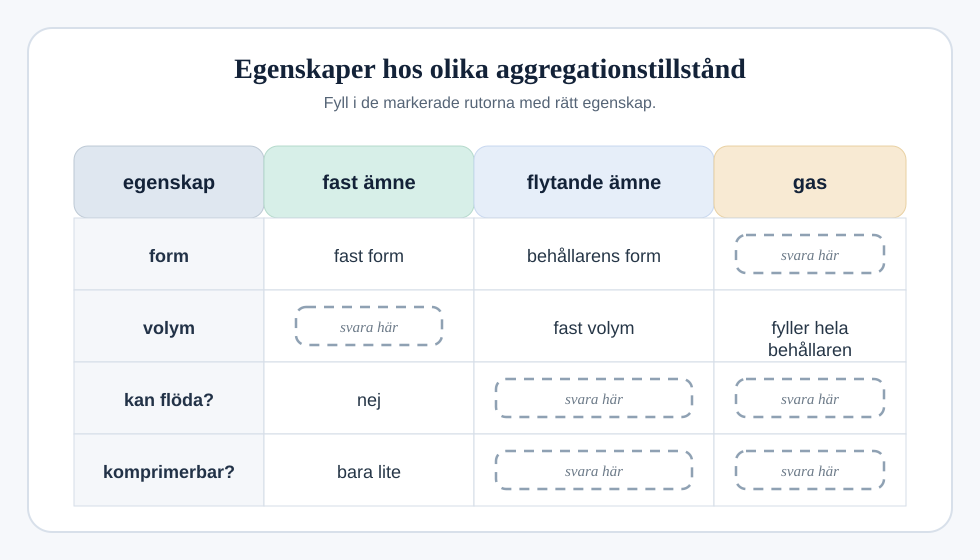

## Aggregationstillstånd och partikelmodell

### (a)
De tre aggregationstillstånden är `fast ämne`, `flytande ämne` och `gas`.

Fyll i tabellen för att visa deras egenskaper.

`[3]`

### (b)
Partikelmodellen kan användas för att förklara egenskaperna hos de olika aggregationstillstånden.

Cirklarna i modellen nedan representerar partiklarna i ett `flytande ämne`.

#### (i)
Rita cirklar för att representera partiklarna i ett `fast ämne` och i en `gas`.

`[2]`

#### (ii)
Flytande ämnen kan bara komprimeras lite.

Förklara varför.

....................................................................................................

.................................................................................................... `[1]`

### (c)
Gaser utövar ett tryck mot behållarens väggar.

Vad orsakar detta tryck?

....................................................................................................

.................................................................................................... `[1]`
