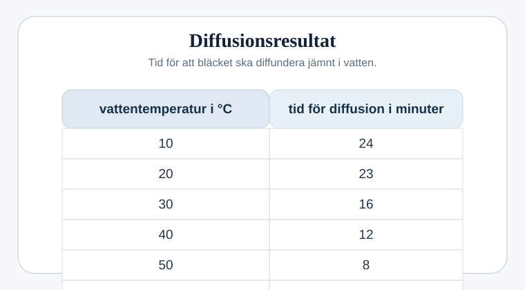
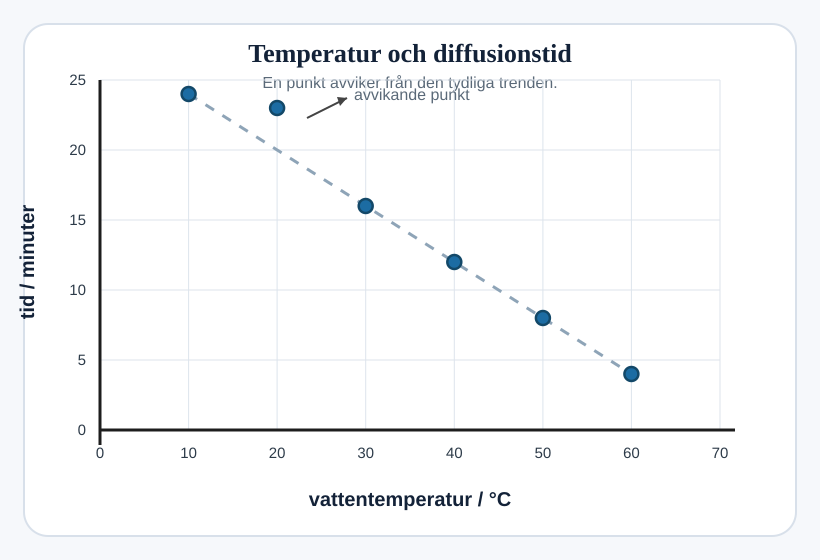

## Diffusion av bläck i vatten

Jamal undersöker hur bläck diffunderar i vatten.

Han använder sex provrör med vatten i olika temperaturer: `10 °C`, `20 °C`, `30 °C`, `40 °C`, `50 °C` och `60 °C`.

Jamal registrerar hur lång tid det tar för bläcket i varje provrör att diffundera jämnt.

Här är hans resultat.

### (a)
Samma volym vatten används i varje provrör.

Varför är detta viktigt?

....................................................................................................

.................................................................................................... `[1]`

### (b)
Jamal ritar ett diagram.

#### (i)
Slutför diagrammet med Jamals resultat. `[1]`

#### (ii)
Jamal tror att resultatet för en temperatur är fel.

Det felaktiga resultatet är vid `.............. °C`. `[1]`

#### (iii)
Rita den bästa raka linjen genom de rätta punkterna. `[1]`

### (c)
Jamal noterar att resultaten visar ett mönster.

Beskriv mönstret i hans resultat.

....................................................................................................

.................................................................................................... `[1]`

### (d)
Föreslå ett sätt som Jamal kan förbättra sin undersökning.

....................................................................................................

.................................................................................................... `[1]`
