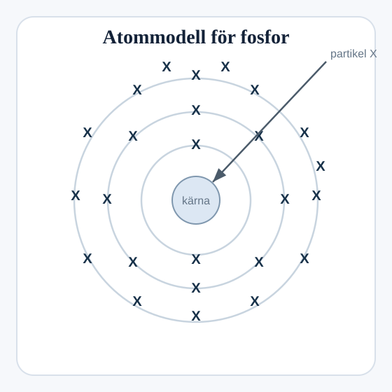

## Fosforatom och kärnpartiklar

Diagrammet visar en atom av fosfor.

### (a)
Vad heter partikel `X`?

.................................................................................................... `[1]`

### (b)
Hur många partiklar finns det i kärnan hos denna fosforatom?

.................................................................................................... `[1]`
