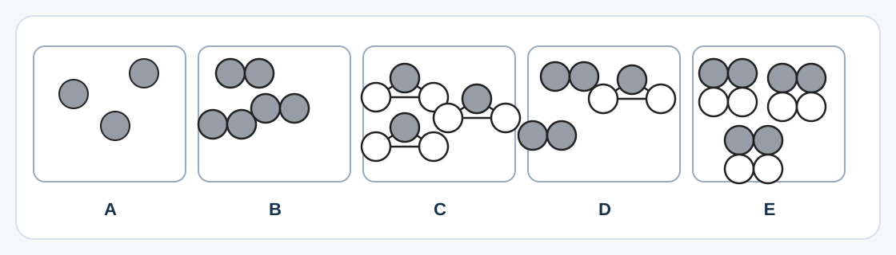

## Grundämnen, föreningar och blandningar

Titta på diagrammen.

### (a)
Vilket diagram (`A`, `B`, `C`, `D` eller `E`) visar:

#### (i)
Ett grundämne bestående av enskilda atomer?

................................................ `[1]`

#### (ii)
En förening bestående av molekyler?

................................................ `[1]`

#### (iii)
En blandning av ett grundämne och en förening?

................................................ `[1]`

### (b)
Fyll i meningarna och förklara om ämnena är blandningar eller föreningar.

#### (i)
Havsvatten är en ................................ därför att

.................................................................................................... `[1]`

#### (ii)
Fast natriumklorid är en ................................ därför att

.................................................................................................... `[1]`
