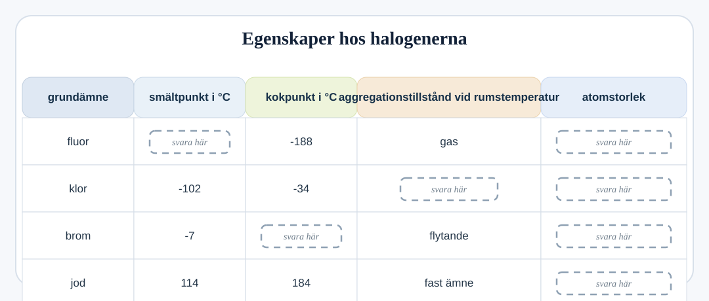
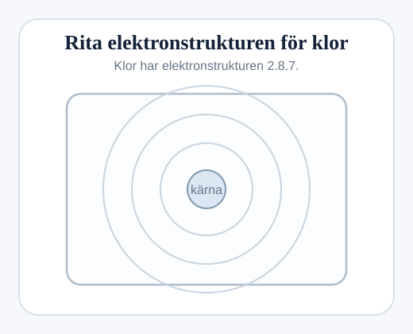

## Halogenerna i grupp 7

Tabellen visar information om fyra grundämnen.

Dessa fyra grundämnen finns i samma grupp i periodiska systemet. De är listade i den ordning de förekommer i periodiska systemet.

### (a)
Det finns en trend i smält- och kokpunkterna för dessa grundämnen.

Använd trenden för att förutsäga:

#### (i)
Smältpunkten för fluor: `.............. °C` `[1]`

#### (ii)
Kokpunkten för brom: `.............. °C` `[1]`

### (b)
#### (i)
Rumstemperatur är ungefär `20 °C`.

Förutsäg klorens aggregationstillstånd vid rumstemperatur.

.................................................................................................... `[1]`

#### (ii)
Titta på dessa tal: `133   99   114   64`

Talen representerar atomstorlekarna. Ju större tal, desto större atom.

Använd dessa fyra tal för att fylla i kolumnen `atomstorlek (jämförelse)` i tabellen. `[1]`

### (c)
Fluor har två elektronskal med elektronstrukturen `2.7`.

Klor har elektronstrukturen `2.8.7`.

Rita elektronstrukturen för klor i rutan.

`[3]`
