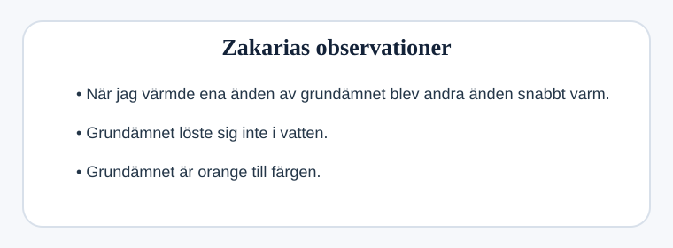

## Metall eller icke-metall?

Zakaria har ett okänt grundämne.

Han vill ta reda på om det är en metall eller en icke-metall.

Zakaria skriver ned sina resultat.

### (a)
Tror du att detta grundämne är en metall eller en icke-metall?

Vilket påstående i Zakarias resultat fick dig att bestämma dig?

.................................................................................................... `[1]`

### (b)
Beskriv ytterligare två skillnader mellan metaller och icke-metaller.

`1.` ................................................................................................

`2.` ................................................................................................ `[2]`
