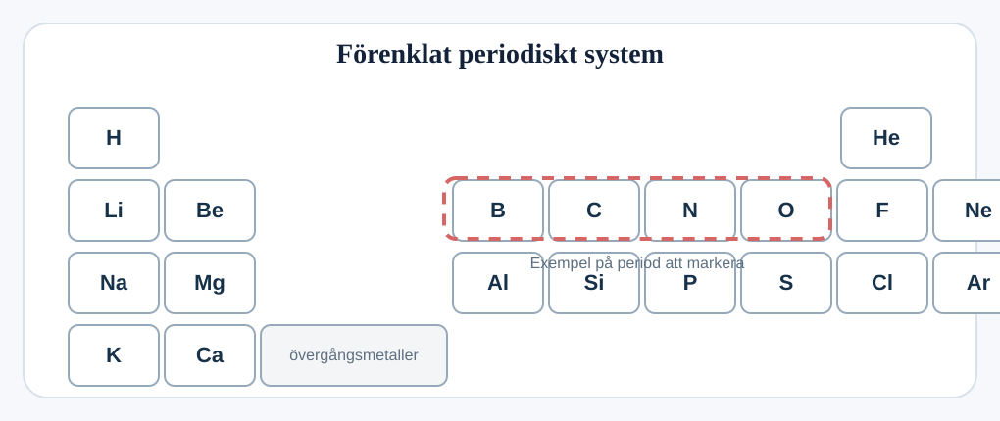
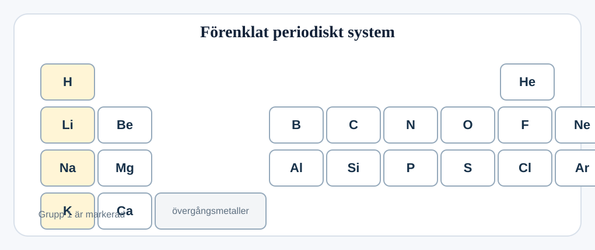

## Perioder, grupper och trender

Denna fråga handlar om periodiska systemet.

### (a)
#### (i)
Markera en period i periodiska systemet. `[1]`

#### (ii)
Skriv den kemiska symbolen för ett metallelement i tabellen.

.................................................................................................... `[1]`

### (b)
#### (i)
Markera grundämnena i grupp 1 i periodiska systemet nedan. `[1]`

#### (ii)
Smältpunkten minskar uppifrån och ned i gruppen.

Beskriv ytterligare en trend som förändras uppifrån och ned i gruppen.

....................................................................................................

.................................................................................................... `[1]`
