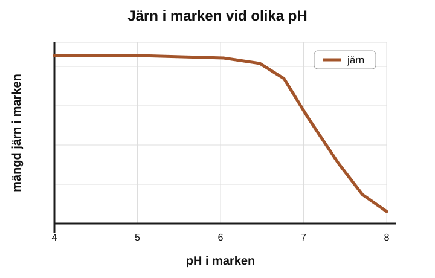
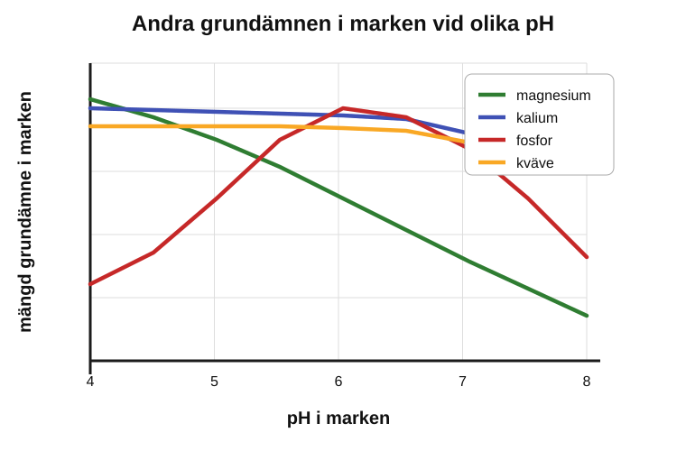

För att växa bra behöver växter ta upp mineraler från marken. Dessa mineraler innehåller kemiska grundämnen.

(a) De flesta jordar har ett pH mellan 4 och 8,5.

Diagrammet visar hur pH påverkar mängden järn i marken.

Diagrammet visar att marken innehåller störst mängd järn mellan pH 4 och 6,7. Ovanför pH 6,7 minskar mängden järn.

Diagrammet nedan visar hur pH påverkar mängden av andra grundämnen i marken.

(i) Använd informationen i diagrammen för att svara.

Förklara varför växter växer bra vid pH 7.
.......................................................................................

Förklara varför växter inte växer bra vid pH 4.
.......................................................................................[2]

(ii) Vilket grundämne finns i minst mängd när markens pH är större än 7?

Välj bland: järn  kväve  fosfor  kalium  magnesium

svar .................................................................................[1]

(b) Marken kan förbättras genom att tillsätta ruttnande växtmaterial eller djuravfall.

(i) Vilken grupp av organismer orsakar ruttnande?
.......................................................................................[1]

(ii) Förklara varför tillsats av ruttnande växtmaterial eller djuravfall förbättrar marken.
.......................................................................................[1]
