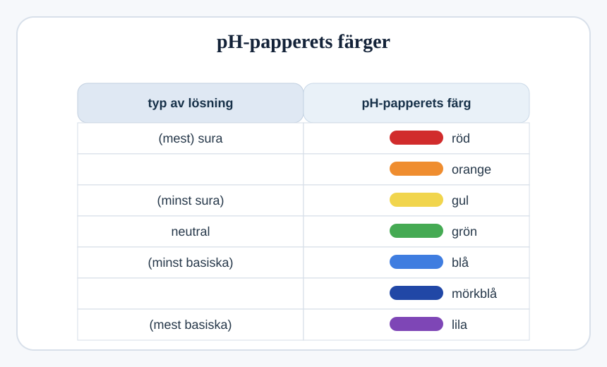
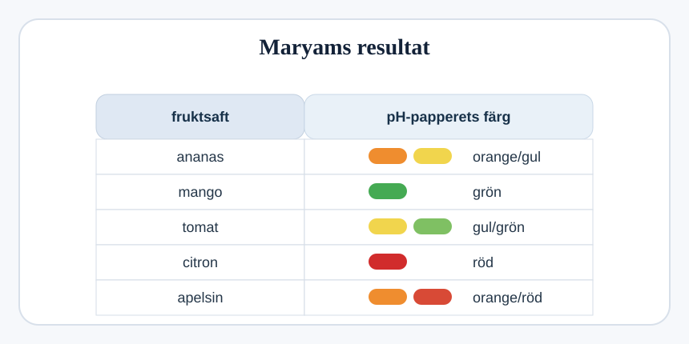

## pH-papper och fruktsafter

pH-papper kan ändra färg i olika lösningar.

### (a)
Maryam testar olika fruktsafter med pH-papper.

#### (i)
Vilken saft är neutral?

.................................................................................................... `[1]`

#### (ii)
Vilken saft är mest sur?

.................................................................................................... `[1]`

### (b)
Maryam doppar pH-papper i en lösning med pH 10.

Föreslå vilken färg pH-pappret får.

.................................................................................................... `[1]`

### (c)
Maryam blandar en basisk lösning med apelsinjuice.

Vad kallas den reaktion som sker mellan en bas och en syra?

.................................................................................................... `[1]`
