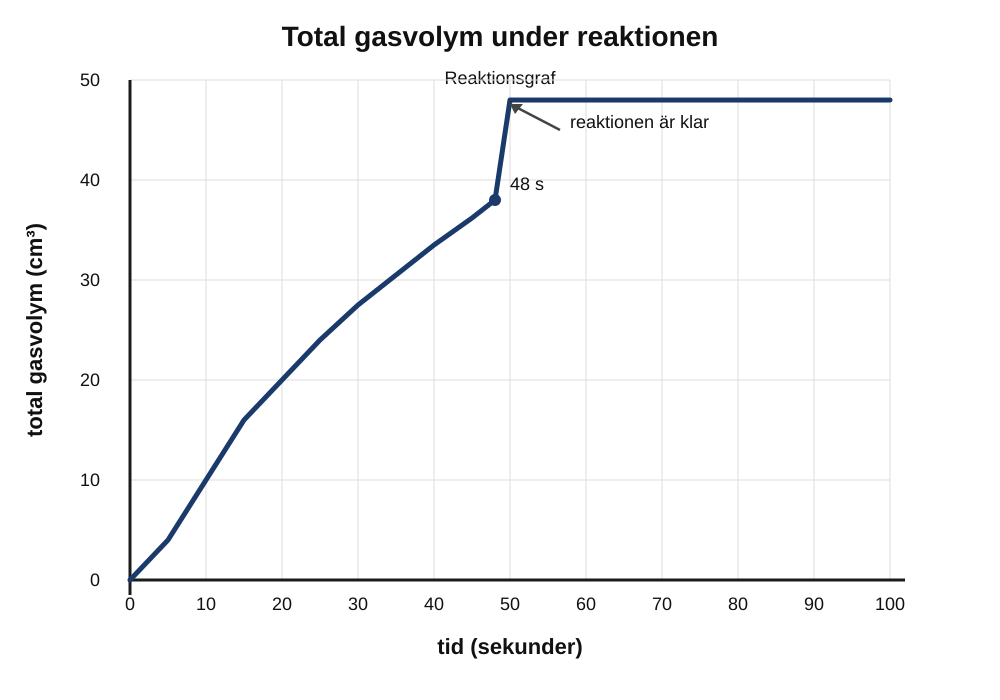

Grafen visar den totala gasvolymen som bildas under en kemisk reaktion med en syra.

(a) Fyll i meningarna för att beskriva mönstret i grafen.

Mellan 0 och 48 sekunder .................................................... gasvolymen.

Efter 48 sekunder ............................................................ reaktionen.                                                    [2]

(b) Försöket upprepas med en lägre koncentration av syran. Alla andra faktorer hålls konstanta.

Vad händer med reaktionshastigheten när syrans koncentration är lägre?
....................................................................................[1]

(c) En ökad temperatur ökar reaktionshastigheten.

Förklara varför.
Använd partikelteori och kollisioner i ditt svar.
...................................................................................
...................................................................................
....................................................................................[2]
