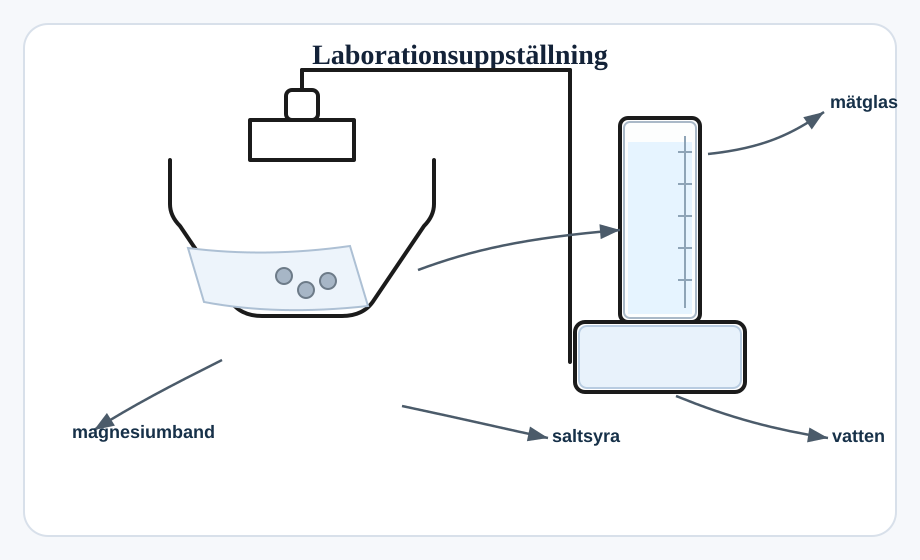
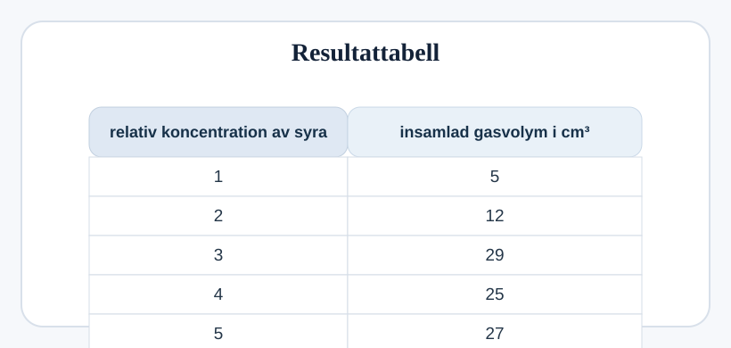

## Avvikande värde i laboration

Fatima och Ahmed undersöker reaktionshastigheten hos reaktionen mellan saltsyra och magnesium.

Diagrammet visar den apparatur de använder.

Kolven innehåller `1 cm magnesiumband` och `25 cm³ saltsyra`.

Fatima och Ahmed mäter volymen gas som bildas på `2 minuter`.

De upprepar experimentet med olika koncentrationer av syra.

Här är deras resultattabell.

### (a)
Vilket resultat är det avvikande värdet?

.................................................................................................... `[1]`

### (b)
Hur kan de kontrollera om detta resultat verkligen är ett avvikande värde?

.................................................................................................... `[1]`

### (c)
Fatima och Ahmed vill förbättra sitt experiment för att få mer noggranna resultat.

Vilken förbättring bör de göra?

Kryssa i rätt ruta.

- [ ] Byt ut syran mot en bas.
- [ ] Byt ut den koniska kolven mot ett bägarglas.
- [ ] Använd en gasspruta i stället för ett mätglas.
- [ ] Byt ut magnesium mot järn. `[1]`
