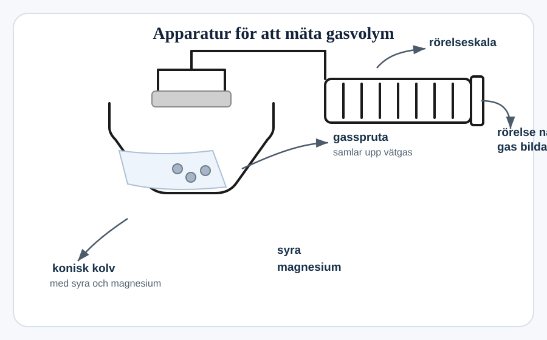
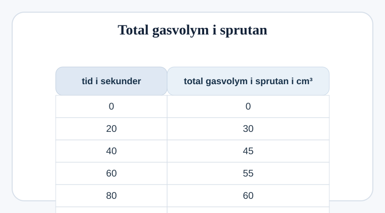
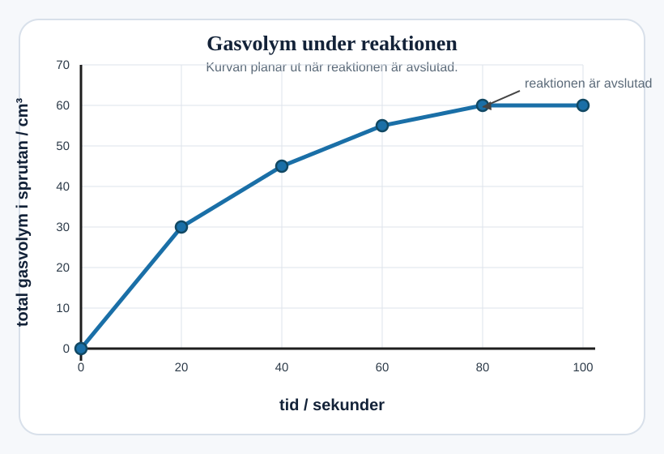

## Magnesium och saltsyra

David undersöker reaktionen mellan magnesium och saltsyra.

Magnesiumklorid och vätgas bildas.

### (a)
Skriv ordkvationen för denna reaktion.

`......................  +  ......................  →  ......................  +  ......................` `[1]`

### (b)
Han använder denna apparatur.

#### (i)
Vilken säkerhetsåtgärd måste David vidta?

Förklara ditt svar.

....................................................................................................

.................................................................................................... `[2]`

#### (ii)
Hur kan han säkerställa att hans resultat är tillförlitliga?

....................................................................................................

.................................................................................................... `[1]`

### (c)
Tabellen visar hans resultat.

#### (i)
Slutför diagrammet med resultaten från tabellen. `[1]`

#### (ii)
Rita bästa linjen för att avsluta diagrammet. `[1]`

#### (iii)
Använd ditt diagram för att ta reda på när reaktionen är avslutad.

`.............. sekunder` `[1]`

#### (iv)
Fyll i meningen.

Reaktionen är snabbast mellan `.............. sekunder` och `.............. sekunder`. `[1]`

### (d)
Vad kan öka reaktionshastigheten mellan magnesium och saltsyra?

Kryssa i tre rutor.

- [ ] Använd en mer utspädd saltsyra.
- [ ] Tillsätt en katalysator.
- [ ] Använd samma massa magnesium som ett fint pulver.
- [ ] Använd samma massa magnesium som ett stort stycke.
- [ ] Öka temperaturen på syran.
- [ ] Sänk temperaturen på syran. `[2]`
