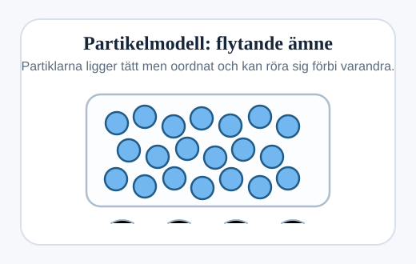
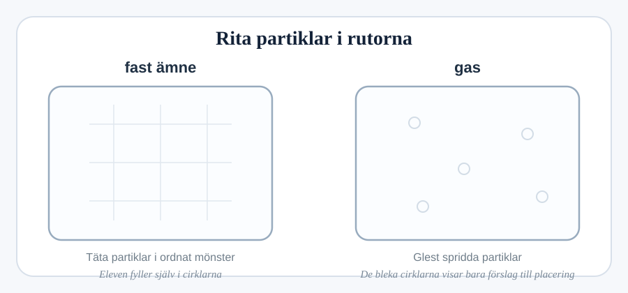

(a) De tre aggregationstillstånden är fast ämne, flytande ämne och gas.

Fyll i tabellen för att visa deras egenskaper.

                                                                [3]

(b) Partikelmodellen kan användas för att förklara egenskaperna.

Cirklar representerar partiklarna i ett flytande ämne.

(i) Rita cirklar för att representera partiklarna i ett fast ämne och en gas.

[fast ämne: ruta 150×150 px för ritning]
[gas: ruta 150×150 px för ritning]

                                                                [2]

(ii) Flytande ämnen kan bara komprimeras lite.

Förklara varför.
.......................................................................................[1]

(c) Gaser utövar ett tryck mot behållarens väggar.

Vad orsakar detta tryck?
.......................................................................................[1]
