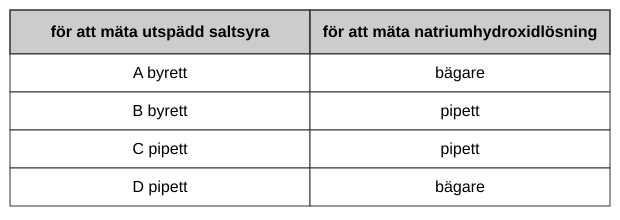

Vid en titrering överförs 25,0 cm³ utspädd natriumhydroxidlösning till en konisk kolv med hjälp av en pipett. Några droppar indikator tillsätts. Utspädd saltsyra tillsätts sedan till kolven från ett mätinstrument tills slutpunkten nås.

Vilka mätinstrument används för att mäta volymerna i detta experiment?

|  | för att mäta utspädd saltsyra | för att mäta natriumhydroxidlösning |
|---|---|---|
| A | byrett | bägare |
| B | byrett | pipett |
| C | pipett | pipett |
| D | pipett | bägare |
