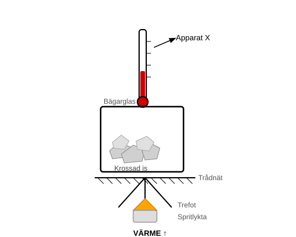
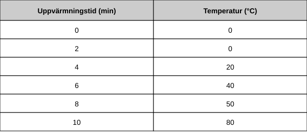

Olle undersöker fasövergångar.

Han lägger krossad is i ett bägarglas och värmer det försiktigt.

Var 2:e minut registrerar han temperaturen med Apparat X.

(a) Vad heter Apparat X?
    ...................................................................[1]

(b) Tabellen visar Olles resultat.

    (i) Beskriv mönstret i dessa resultat efter de första 2 minuterna.
        ....................................................................................[1]

    (ii) Vilket resultat avviker från mönstret?
         Temperatur: .............. °C                             [1]

(c) Fyll i meningarna.

    Under de första 2 minuterna övergår isen från ett
    ..................................... till ett ...................................... .

    Under de följande 2 minuterna tar partiklarna upp mer
    ..................................... och rör sig ..................................... . [2]
