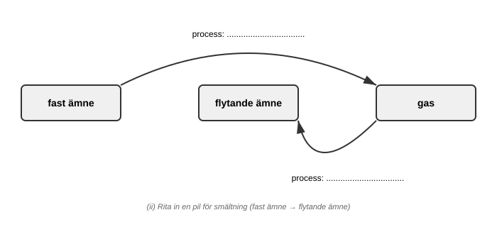

(a) Farid har tre olika bränslen.

    Dra streck mellan varje bränsle och rätt aggregationstillstånd.

                                                                [1]

(b) (i) Fasta ämnen, flytande ämnen och gaser kan övergå från
        ett aggregationstillstånd till ett annat.

        Använd orden i listan för att namnge de processer som
        visas i diagrammet.

        kondensation   avdunstning   stelning   sublimering

                                                                [2]

    (ii) Rita in en pil (→) i diagrammet för att visa vad som
         händer vid smältning.                                  [1]
