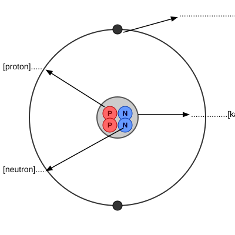
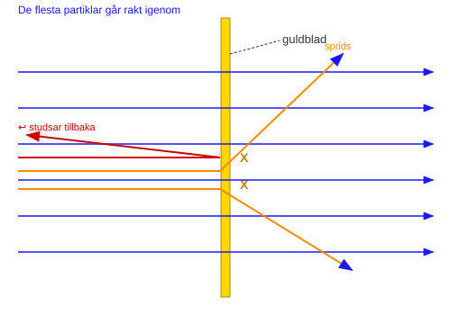

Ernest Rutherford hjälpte till att utveckla en modell av atomen.

(a) Märk ut diagrammet av en heliumatom med dessa ord:

    elektron   kärna   neutron   proton

                                                                [2]

(b) Ernest Rutherford sköt mycket små partiklar mot ett tunt
    guldblad.

    Diagrammet visar partiklarnas banor.

    De flesta partiklar går rakt igenom guldbladet.
    Andra partiklar sprids när de träffar del av guldatomen.

    Vilken del av guldatomen gör att de små partiklarna
    sprids?
    .......................................................................................[1]
