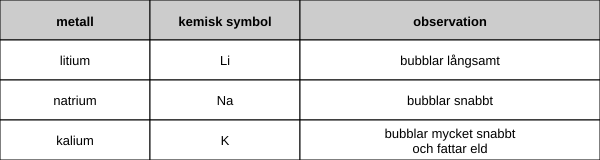

En lärare visar sina elever reaktionerna hos några metaller med vatten.

Han börjar med att lägga små mängder av metallerna i en skål med vatten.

Tabellen visar de observationer som eleverna gör.

(a) Läraren måste hålla sig själv och sina elever säkra
    när han utför experimentet.

    Beskriv ett sätt han kan göra detta.
    ......................................................................................................................................[1]

(b) En gas bildas när dessa metaller reagerar med vatten.

    Vad heter gasen?

    Ringa in rätt svar.

    koldioxid    vätgas    kväve    syre                              [1]

(c) Alla metaller som läraren använder finns i grupp 1
    i periodiska systemet.

    (i) Vilken av de tre metallerna är mest reaktiv?
        .......................................................................................[1]

    (ii) Rubidium finns också i grupp 1.
         Det befinner sig under kalium i periodiska systemet.

         Förutsäg vad som händer när rubidium läggs i vatten.
        .......................................................................................[1]
